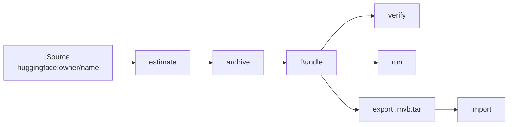

<h1 align="center">
  
</h1>

<p align="center">
  <strong>the genesis machine of archives</strong>
</p>

<p align="center">
  <a href="https://github.com/jeremynorris/darsay/actions/workflows/ci.yml"></a>
  <a href="https://github.com/jeremynorris/darsay/blob/main/LICENSE"></a>
  
  
  
</p>

<p align="center">
  <a href="#quick-start">Quick start</a> ·
  <a href="#how-it-works">How it works</a> ·
  <a href="#a-bundle">A bundle</a> ·
  <a href="#commands">Commands</a> ·
  <a href="docs/README.md">Documentation</a> ·
  <a href="CONTRIBUTING.md">Contributing</a>
</p>

---

darsay pulls a model or dataset from a source (Hugging Face today) at a
**pinned revision**, hashes every file, cross-checks upstream checksums,
captures the license verbatim, extracts metadata from the payload itself, and
writes a bundle that any Hugging Face-compatible loader uses **as-is**.

When you want the archived model to speak:

```bash
darsay run vault/qwen--qwen3-0.6b/<rev> "Say hello"
```

That command hydrates an isolated environment, runs **offline**, and leaves
the payload byte-immutable. Before you commit tens of gigabytes,
`darsay estimate` prices the source from upstream metadata alone.

<table>
<tr>
<td width="50%" valign="top">

**Estimate first.** Price a 50 GB model from Hub metadata. Nothing downloaded.

</td>
<td width="50%" valign="top">

**Archive for keeps.** Pinned revision, hashed, license captured, payload immutable.

</td>
</tr>
<tr>
<td width="50%" valign="top">

**Resume anything.** Budgets, Ctrl-C, USB sticks, collaborators with `--shard 1/3`.

</td>
<td width="50%" valign="top">

**Run offline.** One command. Isolated env. `HF_HUB_OFFLINE=1`. Payload untouched.

</td>
</tr>
</table>

## Why it exists

The Hub is a living website, not an archive. Repos get gated, rewritten, and
deleted. Datasets vanish faster than weights. Published quants — the official
FP8, the community GGUF people actually ran — cannot be regenerated bit-exact
from the master. If it matters what the world used, the bytes themselves must
be kept, with a manifest that records facts and never fabricates them.

A darsay bundle is that record: **immutable payload + machine-readable
manifest + derived views + one curator file**. The tool is replaceable. The
formats are not.

## Quick start

Requires Python 3.10+. One pure-Python wheel for every OS. Isolated CLI
tools are the intended way to run a release; see
[docs/DISTRIBUTION.md](docs/DISTRIBUTION.md).

```bash
pipx install git+https://github.com/jeremynorris/darsay@v0.6.0
# or, one-shot with no install:
uvx --from git+https://github.com/jeremynorris/darsay@v0.6.0 darsay --help
```

Then:

```bash
darsay estimate Qwen/Qwen3-0.6B
darsay archive  Qwen/Qwen3-0.6B
darsay run      vault/qwen--qwen3-0.6b/<rev> "Say hello"
```

<details>
<summary><strong>Development checkout and extras</strong></summary>

```bash
python3 -m venv .venv
.venv/bin/pip install -e .                      # core: huggingface_hub only
.venv/bin/pip install -e ".[fast-hash,smoke]"   # + blake3, tokenizers
.venv/bin/pip install -e ".[inference]"         # + transformers/torch for in-process smoke
.venv/bin/pip install -e ".[datasets]"          # + pyarrow for measured dataset row counts
.venv/bin/pip install -e ".[dev]"               # pytest
.venv/bin/pytest                                # unit + integration; see docs/TESTING.md
```

The extras only serve in-process smoke tests. `darsay run` needs none of
them — hydration builds its own isolated env per engine.

</details>

The vault root defaults to `./vault` (override with `--vault` or
`$DARSAY_HOME`). Bundles are gitignored — they live on disk or in your
backup tier, not in this repo.

## How it works



1. **Estimate** — read-only preflight. Exact sizes, parameter counts, disk
   headroom, quantized ecosystem. Nothing downloaded.
2. **Archive** — pin a revision, transfer bytes (resumable, budgeted,
   cooperative), hash, verify against upstream, write the manifest.
3. **Keep** — the payload never changes again. Metadata at the bundle root
   is mutable by design.
4. **Use** — point any HF-compatible loader at `<bundle>/model`, or
   `darsay run` for one-command offline inference. `export` packs a
   deterministic `.mvb.tar` for offsite storage.

## A bundle

```
vault/qwen--qwen3-0.6b/<revision12>/
├── model/              # immutable payload: pristine snapshot of the upstream repo
├── manifest.json       # machine-readable record — the source of truth
├── README.md           # human-readable summary, generated from the manifest
├── VERIFICATION.md     # latest verification report
├── verification.json   # verification history (last 50 runs)
├── curation.md         # curator's notes — the only hand-edited file
├── exports.json        # log of single-file exports (after first export)
├── hydration.json      # runnable-env record + run history (after first hydrate)
├── transfer.json       # disposable resumable-transfer ledger
├── transfer.lock       # transient writer lock (only during archive/assemble)
└── LICENSE             # upstream license text, surfaced at the root
```

The payload under `model/` (or `data/` for datasets) is **immutable after
archiving**; the bundle hash covers it alone. To use a model, point
`transformers` at `<bundle>/model` — no unpacking, no conversion.

<details>
<summary><strong>What the manifest records</strong></summary>

| Section | Contents |
|---|---|
| `identity` | name, family, publisher, version, release date, bundle id |
| `source` | provider, address, pinned commit, transfer accounting, mirrors, signatures, popularity + tags at archive time |
| `licensing` | SPDX id, license files, commercial / redistribution / modification / attribution flags, patent grant, trademark terms |
| `inventory` | per-file size + SHA-256 (+BLAKE3), upstream checksum match, deterministic bundle hash |
| `model_metadata` | parameter count by dtype (from safetensors headers — no torch), architecture, context, tokenizer, languages |
| `runtime` | engines from shipped formats, estimated min RAM/VRAM, measured hardware from `darsay run` |
| `validation` | checksum verification, completeness, tokenizer + inference smoke tests |
| `relationships` | parents, finetunes, known quantizations + GGUF repos (snapshot at archive time) |
| `archive` | date, host, storage tier, backups, last integrity check |
| `security` | integrity status, unexpected-change flags, trust level |
| `curation` | historical significance, capabilities, limitations, notes (via `curation.md`) |

`schema_version` is recorded in every manifest. Full field-by-field
reference: [docs/MANIFEST.md](docs/MANIFEST.md).

</details>

## Commands

```bash
darsay estimate Qwen/Qwen3.8-27B --variants          # preflight: size, params, disk, quants
darsay estimate unsloth/Qwen3.8-27B-GGUF --include '*Q4_K_M*'
darsay estimate datasets/saidutta69/fable-5-premium  # Hub dataset address grammar
darsay archive  Qwen/Qwen3-0.6B                      # download + hash + manifest
darsay archive  datasets/saidutta69/fable-5-premium  # dataset bundle: payload under data/
darsay archive  Qwen/Qwen3.8-27B --max-gb 10         # pause cleanly; rerun to resume
darsay archive  Qwen/Qwen3.8-27B --dry-run           # verified / partial / missing plan
darsay archive  Qwen/Qwen3.8-27B --shard 1/3 --max-gb 20
darsay --vault ./combined assemble /usb/alice/<bundle> /usb/bob/<bundle>
darsay verify   vault/qwen--qwen3-0.6b/<rev>
darsay smoke    vault/qwen--qwen3-0.6b/<rev> [--inference]
darsay list
darsay info     vault/qwen--qwen3-0.6b/<rev>
darsay regen    vault/qwen--qwen3-0.6b/<rev>         # rebuild README after editing curation.md
darsay export   vault/qwen--qwen3-0.6b/<rev> -o /backups
darsay import   /backups/qwen--qwen3-0.6b@<rev>.mvb.tar

darsay run      vault/qwen--qwen3-0.6b/<rev> "Say hello"
darsay hydrate  vault/qwen--qwen3-0.6b/<rev> [--dry-run]
darsay envs [--prune]
darsay dehydrate vault/qwen--qwen3-0.6b/<rev>
```

Source refs are provider-qualified — `huggingface:Qwen/Qwen3-0.6B`,
`huggingface:datasets/owner/name`. Unprefixed `owner/name` /
`datasets/owner/name` and huggingface.co URLs are Hugging Face shorthand.
Bundle-path commands dispatch on the manifest's `artifact_type`. Adding
another host is a source provider, not a new CLI:
[docs/SOURCES.md](docs/SOURCES.md).

## Estimate before you archive

A 27B model is a 50+ GB commitment. `estimate` is a read-only preflight
against the Hub API — nothing downloaded, nothing written. It reports the
pinned revision's exact inventory, parameter counts by dtype, the engines
the payload will support, a completeness check, and a disk verdict. It
exits non-zero when free space is insufficient, so it doubles as a guard
in scripts. Upstream numbers are facts; derived figures (min RAM, download
scratch) are labeled estimates.

```
$ darsay estimate Qwen/Qwen3.8-27B

Qwen/Qwen3.8-27B @ main -> 1d4bf0f2ff60
  image-text-to-text | license apache-2.0
  parameters:   27.78B BF16  [upstream safetensors metadata]
  payload:      32 files, 51.8 GiB
                weights 51.7 GiB in 18 files (largest 3.7 GiB: model-00004-of-00018.safetensors)
                support 22.0 MiB in 14 files
  engines:      transformers
  completeness: complete
  estimated:    download scratch +3.7 GiB (largest file in flight), min RAM/VRAM 62.1 GB (weight bytes x1.2)
  bundle:       vault/qwen--qwen3.8-27b/1d4bf0f2ff60  (new)
  disk:         needs ~55.5 GiB, free 1022.6 GiB — OK

To archive: darsay archive Qwen/Qwen3.8-27B
```

`--variants` lists the quantized ecosystem (Hub `base_model:quantized`
relation), with query caps recorded in the output. `--include GLOB` prices
a subset of a repo — e.g. one Q4_K_M file inside a 439.7 GiB GGUF pack.
`--json` emits the full machine-readable estimate.

## Incremental, relocatable, cooperative transfers

The first `archive` pins one immutable commit and writes the expected file
set to `transfer.json`. Every later run reconciles that set against local
bytes, trusts already verified files, hashes and adopts unrecorded complete
files, resumes bundle-local `.incomplete` files with HTTP Range, and only
registers `manifest.json` after every expected file is verified.

`--max-gb`, `--max-bytes`, and `--max-minutes` stop cleanly with **exit
code 10**. `--jobs` controls the small-file pool. `--rehash` rechecks
trusted ledger entries.

Partial bundles are self-contained and relocatable. Copy the entire
`<repo-slug>/<revision12>/` directory — including the payload `.cache` —
under a different vault and rerun the same `archive` command. The pin is
unchanged; completed files are adopted; the longest Range partial continues.

Collaborators use `--shard N/T`: `1/3`, `2/3`, and `3/3` deterministically
prioritize different byte-balanced whole-file lanes, but each can still
finish the identical bundle alone. `darsay --vault DEST assemble
PARTIAL...` merges matching partials **offline**.

Full design, ledger shape, and failure semantics:
[docs/INCREMENTAL.md](docs/INCREMENTAL.md).

## Quantized models: fidelity first

The canonical bundle is the **highest-fidelity upstream release**, archived
byte-exact — the master is the negative, quants are prints. Published quants
that matter historically (the official FP8, the community-standard GGUF)
are archived as ordinary **satellite bundles**: most are calibration-based
and can never be regenerated bit-exact from the master.

Everything else — running the model smaller on your own hardware — is
disposable hydration-time derivation, never archival. Full policy:
[docs/QUANTIZATION.md](docs/QUANTIZATION.md).

## Dataset bundles

Datasets are the vault's second artifact type. Models are functions of
data, and datasets are *more* endangered than weights. One sentence covers
the difference: datasets are addressed as `datasets/owner/name` and their
payload lives in `data/`; everything else is identical.

Bundle directories take a `datasets--` prefix. The manifest carries
`dataset_metadata` (formats from the inventory; configs, splits, and
example counts as **declared** upstream claims; **measured** parquet row
counts only when pyarrow is installed). Dataset bundles record
`models_trained_on`; model bundles record `training_datasets`.

`hydrate` / `run` do not apply — a dataset has no engine. Any reader points
at `data/` directly:

```python
import pyarrow.parquet as pq

path = "vault/datasets--cornell-movie-review-data--rotten_tomatoes/aa13bc287fa6/data"
table = pq.read_table(f"{path}/train.parquet")     # 8,530 rows, offline
```

Design and rationale: [docs/DATASETS.md](docs/DATASETS.md).

## Verification

- **At archive time** every file is checked against upstream expectations:
  LFS files against their upstream SHA-256, small files against their git
  blob SHA-1. Result: `verified-against-upstream`.
- **`darsay verify`** re-hashes the payload and diffs it against the
  manifest. Modified, missing, and extra files flip integrity to
  `compromised` and the command exits non-zero — suitable for cron.
- The **bundle hash** (SHA-256 over the sorted per-file hash lines)
  fingerprints the entire payload.

`import` fully re-hashes a payload **before** a bundle enters the vault.
Failures register nothing and exit non-zero.

## Single-file exports (`.mvb.tar`)

`darsay export` packs a whole bundle into one **deterministic tar**:
entries sorted (a `.mvb.json` marker first), tar metadata normalized, no
compression — weights are incompressible and a plain tar stays inspectable
with standard tools. The same bundle state always exports byte-identically,
so the file has one stable SHA-256 for an offsite catalog.

`darsay import` streams the marker, checks format compatibility, unpacks
to staging, re-hashes against the embedded manifest, and only then
registers. Manual recovery without the tool is documented:
[docs/MVB-FORMAT.md](docs/MVB-FORMAT.md).

## Running archived models

`darsay run <bundle> ["prompt"]` goes from bundle to generated tokens
in one command (macOS and Linux). It hydrates first: picks an engine from
what the payload ships (safetensors → `transformers`, GGUF → `llama-cpp`),
builds a dedicated virtualenv **outside the bundle** under
`<vault>/.runtime/envs/` — content-keyed, so matching bundles share one env —
and probes it against the payload.

Inference then runs fully **offline** (`HF_HUB_OFFLINE=1`). A passing run
is evidence the archived payload alone is sufficient. Envs are disposable:
`darsay envs --prune` reclaims the disk; the next `run` rebuilds.

Design details: [docs/HYDRATION.md](docs/HYDRATION.md).

## Extending

New artifact types go in the `ARTIFACT_TYPES` registry
(`src/darsay/schema.py`) — add an entry with its payload root and
completeness rules, and verify / export / report work unchanged. The
`dataset` type was added exactly this way.

New inference runtimes go in `ENGINES` (`src/darsay/hydrate.py`) — a
detection glob, pip requirements, and a standalone runner script. MLX,
vLLM, or ONNX is a registry entry, not a special case.

New acquisition hosts go in `SourceProvider` (`src/darsay/providers/`).
Hugging Face is the first plugin, not the product:
[docs/SOURCES.md](docs/SOURCES.md).

## Documentation

| | |
|---|---|
| [**Documentation home**](docs/README.md) | Map of every document, versions, reading order |
| [Manifest schema](docs/MANIFEST.md) | Field-by-field `manifest.json` reference (v1.5.0) |
| [MVB format](docs/MVB-FORMAT.md) | Deterministic `.mvb.tar` + manual recovery |
| [Hydration](docs/HYDRATION.md) | Bundle → runnable env → offline inference |
| [Incremental transfer](docs/INCREMENTAL.md) | Pin, reconcile, budget, shard, assemble |
| [Datasets](docs/DATASETS.md) | Second artifact type: payload under `data/` |
| [Sources](docs/SOURCES.md) | Provider grammar; Hugging Face as a plugin |
| [Quantization](docs/QUANTIZATION.md) | What is archival vs derived |
| [Design](docs/DESIGN.md) | Why Python; why longevity lives in the formats |
| [Distribution](docs/DISTRIBUTION.md) | Wheels, pipx/uvx, and why not frozen binaries |
| [Testing](docs/TESTING.md) | Unit / integration / opt-in Hub e2e |

## Design

darsay is deliberately Python: hydration runners live inside the
torch / transformers ecosystem, the Hugging Face *provider* uses
`huggingface_hub` as the reference client for that host's snapshot
semantics, and the workload is IO-bound glue. A compiled rewrite would buy
seconds on a tens-of-minutes job.

Longevity is carried by the **formats**, not the tool — plain-JSON
manifests and plain-tar exports, each documented for recovery without
darsay — so the bundles outlive whatever software reads them next.

Full rationale: [docs/DESIGN.md](docs/DESIGN.md).

## License

Apache License 2.0. See [LICENSE](LICENSE). Bundles record *upstream* model
and dataset licenses separately in `manifest.json`; those do not change the
license of this tool.
