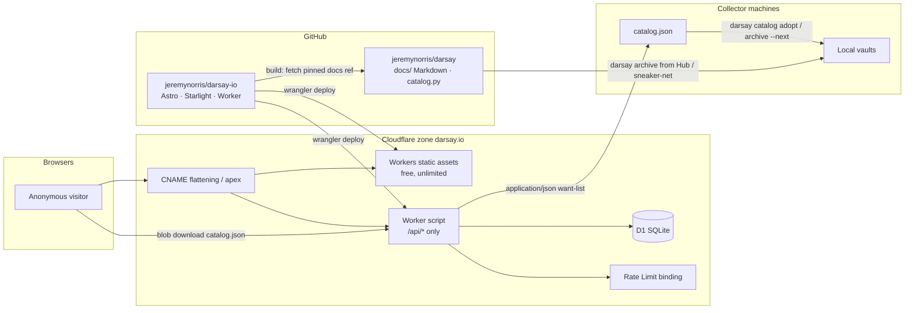
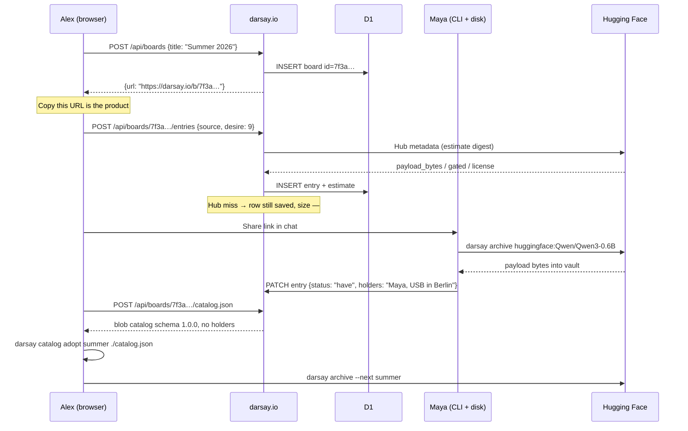
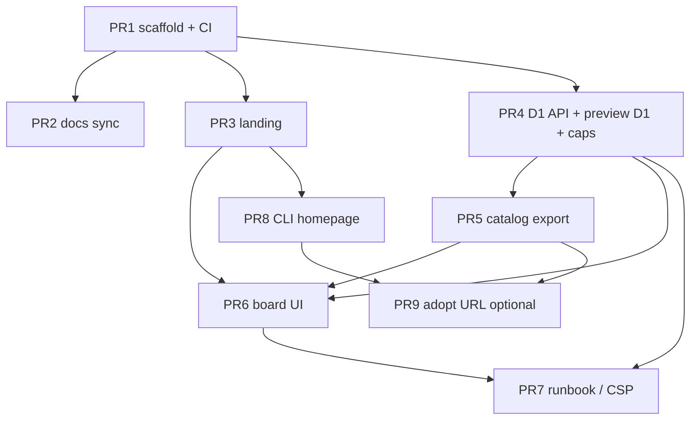

# darsay.io — product site and anonymous want-list leaderboards

| | |
|---|---|
| **Author** | TBD |
| **Date** | 2026-08-26 |
| **Status** | Draft |
| **Audience** | Implementers of the website; readers of the Python CLI who need the lane split |
| **Related** | darsay 0.7.0 · catalog schema 1.0.0 · manifest schema 1.6.0 |
| **Repos** | CLI: `darsay-io/darsay` (today still `jeremynorris/darsay`) · site: `darsay-io/website` |

This is a **proposal**. We will iterate on it before writing production code. Decisions already agreed in conversation are treated as closed unless a later trade-off truly needs a call; those are listed under [Key Decisions](#key-decisions). Genuine forks are under [Open Questions](#open-questions).

---

## Overview

darsay is a Python CLI that archives model (and dataset) ecosystems as museum-grade, still-runnable vault bundles. The tool version today is **0.7.0**. Documentation lives as Markdown in `jeremynorris/darsay` (`docs/`, `examples/README.md`). There is no product website. `pyproject.toml` still points `Homepage` at GitHub.

This document proposes **darsay.io**: one hostname that is both the public documentation/product surface and a small coordination app — **anonymous want-list leaderboards**. A board is a shareable ranking of sources a group intends to archive into *their own* vaults, plus a typed “who has a copy” string so people can sneaker-net. The URL is the capability. There are no accounts.

The CLI remains the only thing that moves payload bytes. The site never stores model files, never hosts `.mvb.tar`, and never writes into a vault. `catalog.json` (schema 1.0.0, `src/darsay/catalog.py`) stays the portable want-list the CLI already understands; a board can **export** that file so someone runs `darsay catalog adopt` and `archive --next` locally. Possession-on-the-board (who has a USB in Berlin) is website state. It must not grow into the catalog schema.

---

## Background & Motivation

### Current state

- **Product docs** are GitHub Markdown. They are good (`docs/GETTING-STARTED.md`, `docs/CONCEPTS.md`, `docs/CATALOGS.md`, field-by-field specs). They are not a site. A 2040 reader of a bundle needs `docs/MANIFEST.md` and `docs/MVB-FORMAT.md`; a 2026 new user needs a URL that is not a repo tree.
- **Catalogs** already exist as a local, file-shaped want-list. `darsay catalog new summer` writes `vault/catalogs/summer/catalog.json`. `darsay list summer` overlays that file on *this* vault (`have` / `partial` / `want` / `unknown`). `archive` does not rewrite the file. Sharing today is “copy the directory to a USB or a git repo” ([examples/README.md § Share a catalog](https://github.com/jeremynorris/darsay/blob/main/examples/README.md)).
- **What catalogs correctly refuse to store:** who has a copy. Possession is a *view* of a vault (`overlay()` in `src/darsay/catalog.py`). A friend’s overlay against an empty vault is all `want`. That is the right archival model. It is the wrong group-coordination model.

### Pain

A small group that wants to keep a set of models currently has to pick a git repo, a spreadsheet, or a chat thread for “what’s next” and “Maya has Qwen3-0.6B on a drive in Berlin.” GitHub issues/PRs as that UI were considered and rejected: git is for the site’s code and the CLI docs, not for editing a leaderboard. They also should not have to run the pytest pyramid, or install Node, to add a row.

### Why a website now, and why it must stay in its lane

darsay’s longevity thesis ([docs/DESIGN.md](https://github.com/jeremynorris/darsay/blob/main/docs/DESIGN.md)) is that **formats outlive tools**. Bundles, manifests, `.mvb.tar`, and `catalog.json` are the archival surface. A website is coordination and a published view of the Markdown. If the site disappears, the CLI, the vaults, and the catalogs still work. If the CLI disappears, a 2040 reader still has the JSON and the specs. That split is an invariant of this design, not a slogan.

---

## Goals & Non-Goals

### Goals (v1)

1. Serve a product homepage at `https://darsay.io/` that states what darsay is, how to install it (`pipx` / `uvx` / the personal Homebrew tap), and what the site is *not*.
2. Publish the existing CLI Markdown as `https://darsay.io/docs/` without rewriting those files in the Python repo.
3. Let anyone create a **board** — a ranked want-list of source refs — at `https://darsay.io/b/<id>`, where `<id>` is an unguessable capability token.
4. Anyone with the link can view **and** edit: add/remove a source, set desire (1–9), mark have, type who has a copy.
5. Export a board’s want-list as a valid `catalog.json` (schema 1.0.0) that `darsay catalog adopt` / `list` / `archive --next` already accept.
6. Stay on Cloudflare’s free tier at expected load (see [Expected load](#expected-load)). Domain cost only; no blob storage bill.

### Non-goals (hard)

| Non-goal | Why it is hard |
|---|---|
| Model drop-off, upload, download, `.mvb.tar` hosting, R2/S3 for weights | Bytes already live at upstream (Hugging Face, etc.). Collectors `darsay archive` from upstream, or sneaker-net a vault bundle. Not in v1 and **not as a later phase**. |
| User accounts, OAuth, email magic links, “my boards” | Account-less is the product. Losing the link loses the board. |
| A public crawlable index of boards | GUID is unlisted, not encrypted. No sitemap, no directory. |
| GitHub issues/PRs as the leaderboard UI | Users cooperate on the website. Git is for code. |
| Splitting view vs edit tokens | Later possible split. v1 is one link. |
| An official global darsay leaderboard | Optional later: just another link someone publishes. |
| Growing `who_has` / `holders` / `status` into `catalog.json` | Possession is a vault view in the CLI; a typed string on the site. `CATALOG_SCHEMA_VERSION` stays `1.0.0`. |
| The website writing into vaults, calling `archive`, or proving a bundle exists | “Have” is a claim. The site does not verify disk. |
| Rewriting CLI docs as part of this work | The website is a published view. Transform at build; source of truth stays `docs/`. |
| Putting a Node toolchain in `jeremynorris/darsay` | See [Repository split](#repository-split). |
| Next.js/Vercel, Netlify-as-CMS, Supabase, a VPS, MkDocs Material | Default stack is Astro + Starlight + Workers + D1. |

### Out of scope for v1 (soft, not forbidden later)

- Read-only vs edit capability URLs.
- `darsay catalog adopt https://darsay.io/...` (CLI today requires `./`, `~/`, or an absolute path; `curl` then adopt is enough).
- Activity log / comments.
- Import of an existing `catalog.json` onto a board (64 KiB JSON bodies cannot hold 200 CLI-sized entries; do not truncate).
- Board search, tags, multi-board dashboards.
- Cloudflare Turnstile on create (hook later if bots show up).

---

## Key Decisions

1. **One hostname, three surfaces.** `darsay.io/` product, `darsay.io/docs/` docs, `darsay.io/b/<id>` a board. Same deploy, same tech.

2. **Separate git repo (`jeremynorris/darsay-io`), not a `website/` tree.** The Python package’s contributors and CI are a pytest pyramid (`docs/TESTING.md`, `.github/workflows/ci.yml`). Catalog/board people must not need that, and the CLI repo must not grow `package-lock.json`, Astro, or Wrangler. Docs stay in `darsay`; the site fetches a pinned ref at build. Justification in [Repository split](#repository-split).

3. **Cloudflare Workers with static assets + a Worker script for `/api/*` + D1.** Not Pages (supported, but 2026 guidance and new investment are on Workers; Rate Limiting bindings exist on Workers and not Pages). Apex `darsay.io` requires the domain as a Cloudflare zone (nameservers at Cloudflare, CNAME flattening).

4. **Astro + Starlight** for product + docs. Interactive board UI is a static client island, not SSR. MkDocs Material is in maintenance mode (Zensical successor) and cannot host the board. No Next.js.

5. **No auth vendor. The board URL is the capability** (unlisted paste / “anyone with the link”). v1: one token for view and edit. Spam control is **named D1 daily caps** (creates/mutates/GETs), not identity. Per-colo Rate Limit bindings are courtesy only.

6. **The site never stores model bytes.** JSON API only. No R2, no multipart, no “attach a bundle.” Reject anything that looks like a payload upload.

7. **`catalog.json` is an export, not the edit format.** Board extra state is people/who-has-it. Export omits it. The catalog schema does not change.

8. **Board page views are static assets (free); only `/api/*` invokes the Worker.** Avoids burning the 100k Worker-requests/day free cap on HTML. `run_worker_first` is path-scoped to `/api/*`.

9. **“Have” on a board is a claim, not a vault overlay.** `overlay()` in `catalog.py` remains the only possession the CLI believes. Maya marking have on darsay.io does not flip Sam’s `darsay list`.

10. **Estimates are fetched on add, never invented.** Adding (or retargeting) a Hugging Face source makes the Worker call the Hub the way `darsay estimate` does, then store a `DIGEST_KEYS` projection. Size is that `payload_bytes`. If the Hub does not answer (gated without a token, 404, timeout, opaque non-HF source), the row still saves and `estimate` stays `null` — size shows “—”. The Worker does not guess sizes. Matches `docs/CATALOGS.md`: `null` means unknown.

11. **Do not index boards.** `robots.txt` disallows `/b/` and `/api/`. Starlight/Astro sitemap is **off** (or filtered to exclude `/b/` and `/api/`). `X-Robots-Tag: noindex, nofollow` on those paths. `Referrer-Policy: no-referrer` on `/b/*` (static `_headers`) **and** on every `/api/*` response (set in the Worker — `_headers` does not apply to Worker-generated responses).

12. **`include` globs are an advanced UI field**, hidden behind “subset / include.” They are part of row identity and must round-trip in argv order (see [Include identity](#include-identity)). Never drop them on export.

13. **Default `catalog_id`:** slugify the title (`Summer 2026` → `summer-2026`); if the result does not match `SLUG_RE` after casefold, use `board`. A **client-supplied** `catalog_id` is `fold_slug` (strip + casefold) then `SLUG_RE`; else **400** — do not silently replace a user id with `board`. Title may be 120 chars; `SLUG_RE` is max 64 after fold, so an explicit id that is too long is 400. The GUID is never the catalog `id`.

14. **Create-board acknowledgement is a checkbox**, not a hard clipboard requirement. Clipboard permissions fail often enough to strand people. Copy button is prominent; dismiss requires “I have copied this URL.”

15. **No catalog import in v1.** Export is required. A max-size CLI `catalog.json` will not fit the 64 KiB JSON body cap; raising the cap only for import is a later PR. Do not silently skip extra entries or globs.

16. **Generated docs are committed.** `scripts/sync-docs.mjs` writes `src/content/docs/docs/**`; CI fails if a dry-run differs from git. Reviewers see the published Markdown. The lockfile + transform remain the source of truth for *how* it was produced.

17. **Timestamps match `utc_now()`:** `datetime.now(timezone.utc).isoformat(timespec="seconds")` → `2026-08-26T18:04:11+00:00`, not `Z`. `desire` is always a JSON integer (or `null`); never a float (`load_catalog` uses `isinstance(desire, int)`).

18. **Spam backstop is D1 only in v1.** Global: **100 board creates per UTC day**; **10 000 entry mutations (INSERT/UPDATE/DELETE) per UTC day**; stop creates first. D1 errors that look like daily quota → **503**. **Do not configure Rate Limit bindings** unless we later move to Workers Paid. If spam exceeds Free D1/Worker caps, Paid ($5) is the spam plan. See [Limits](#limits-request).

19. **Board-id lookups are throttled, not GET-only.** A D1 global **50 000 lookups / UTC day** on every `/api/*` request that takes a board id (GET/PATCH/DELETE board, POST/PATCH/DELETE entries, GET/POST catalog.json). `POST /api/boards` (create) counts as a create, not a lookup. A determined scanner can knock the **API** offline for the rest of the UTC day; `/` and `/docs/` stay up (static). That is an accepted Free-tier risk. 2^128 protects confidentiality, not availability. The lookup counter is a D1 **write**; 50k lookups + 10k mutates ≈ 60k of the 100k writes/day allowance.

20. **`workers_dev: false`, a separate preview D1, and API security headers ship in the same PR as the first D1** (PR 4). Preview must not share production data. Custom `console.log` may truncate ids; invocation logs include the request URL and there is **no confirmed first-class path-segment redaction** — operator-visible capability URLs are accepted (the operator can already read D1) and disclosed on `/privacy`. Default `observability.logs.invocation_logs = false`.

21. **Catalog download is a blob, not a copyable API href.** The UI uses `fetch` + `URL.createObjectURL` / `Content-Disposition` (POST preferred). `GET /api/boards/:id/catalog.json` remains for `curl` and **is the same write capability as the board URL**. Sharing that GET URL shares the board. Optional later HTTPS `catalog adopt` puts a secret in shell history.

22. **Production docs from the latest CLI tag.** `docs.lock.json` pins `v0.7.0` (then each later tag). `/docs/` matches `pipx install darsay`. A `/docs/dev/` from `main` is later, not v1.

23. **No official darsay board in v1.** Anyone can create a board. If we publish one later, it is a homepage footer link to a normal `/b/<id>` — same code path, no `/official` index.

24. **CLI `catalog adopt` from HTTPS is later.** v1 is download or `curl` the catalog file, then path-addressed `darsay catalog adopt MINE ./catalog.json`. HTTPS adopt puts a write-capability URL in shell history; that needs a separate CLI design pass.

25. **No Turnstile in v1.** Create-board is a button; D1’s 100 creates/UTC day is the spam limit. Wire a later hook if bots appear. Not a CAPTCHA at launch.

---

## Proposed Design

### High-level architecture



Static HTML/CSS/JS for `/`, `/docs/*`, and the `/b/*` shell never hits D1. The board island `fetch`es `/api/boards/:id`. Create/edit are JSON POSTs/PATCHes/DELETEs.

### Request routing

Workers serve static assets **ahead of** the Worker script unless `assets.run_worker_first` matches. That is the cost control:

```jsonc
// wrangler.jsonc (production sketch)
{
  "name": "darsay-io",
  "compatibility_date": "2026-08-26",
  "main": "src/worker/index.ts",
  "workers_dev": false,
  "preview_urls": true,
  "routes": [
    { "pattern": "darsay.io", "custom_domain": true }
  ],
  "assets": {
    "directory": "./dist",
    "binding": "ASSETS",
    "not_found_handling": "404-page",
    "html_handling": "auto-trailing-slash",
    "run_worker_first": ["/api/*"]
  },
  "d1_databases": [
    { "binding": "DB", "database_name": "darsay-io", "database_id": "<prod>" }
  ],
  // Courtesy only: unique limit *per Cloudflare location*; IP keys are
  // discouraged. Authoritative caps are D1 counters (see Limits).
  // Bindings are GA; Free-plan availability is *not documented* — if
  // deploy rejects them, omit and keep D1 caps. Paid ($5) is the spam plan.
  "ratelimits": [
    { "name": "CREATE_LIMIT", "namespace_id": "1001", "simple": { "limit": 5, "period": 60 } },
    { "name": "MUTATE_LIMIT", "namespace_id": "1002", "simple": { "limit": 60, "period": 60 } },
    { "name": "LOOKUP_LIMIT", "namespace_id": "1003", "simple": { "limit": 60, "period": 60 } }
  ],
  "observability": {
    "enabled": true,
    "logs": { "invocation_logs": false, "head_sampling_rate": 1 }
  },
  "env": {
    "preview": {
      "name": "darsay-io-preview",
      "workers_dev": false,
      "d1_databases": [
        { "binding": "DB", "database_name": "darsay-io-preview", "database_id": "<preview>" }
      ]
    }
  }
}
```

Custom-domain `pattern` is the **hostname** (`darsay.io`), not `darsay.io/*`. Wildcards are invalid on custom domains. `www.darsay.io` is **not** a second Worker custom domain: a **zone Redirect Rule** 301s `https://www.darsay.io/*` → `https://darsay.io/$1` (Workers `_redirects` matches paths, not `Host`). Path `_redirects` still does `/b/* /b/index.html 200`.

`POST /api/boards` builds `url` from `new URL(request.url).origin` (`https://darsay.io/b/<id>` in prod; the preview origin in preview). Never hardcode the apex.

- `GET /`, `/docs/*`, hashed assets → static, **free**, unlimited.
- `GET /b/<id>` → static shell (`/b/index.html` via `_redirects` 200 rewrite). Client reads the id from `location.pathname`. **Free.**
- `/api/*` → Worker + D1. Counts against 100,000 requests/day (Free) and 10 ms CPU/request. Exceeding the Worker request cap returns **429** for `/api/*` for the rest of the UTC day; static routes keep serving.

`workers_dev: false` in **both** production and preview so board URLs are not also reachable on a guessable `*.workers.dev` host. Preview URLs (versioned `*.workers.dev` preview, if enabled) must use the **preview** D1 and should sit behind Cloudflare Access. These controls ship in PR 4, not a later hardening PR.

### Site map

| Path | Kind | Source |
|---|---|---|
| `/` | Product landing | `src/pages/index.astro` (website-native) |
| `/docs/` | Docs home | Published view of `docs/README.md` |
| `/docs/getting-started/` … | Specs & guides | Published view of `docs/*.md` + `examples/README.md` |
| `/boards` (optional alias `/new`) | Create UX + “copy this URL” | Website-native |
| `/b/<id>` | Board island | Client + `/api` |
| `/api/boards` | JSON API | Worker |
| `/privacy`, `/terms` | Minimal legal | Website-native |
| `/robots.txt` | Disallow `/b/`, `/api/` | `public/robots.txt` |

Starlight content lives under `src/content/docs/docs/` so file-based routes are `/docs/...` (see the filename map under [Docs publishing](#docs-publishing-do-not-rewrite-the-docs)). The Starlight landing at `/` is replaced by the custom product page. Sitemap off.

### Product homepage (must say)

- Tagline already in the CLI README: **Keep a model forever. Run it tomorrow.**
- Install, matching `docs/DISTRIBUTION.md` / `docs/GETTING-STARTED.md`:

```bash
pipx install darsay
# or
uvx darsay --help
```

- Three verbs: `estimate` → `archive` → `run` (offline).
- Catalogs in one sentence: a curated list of sources; the vault is that list, realized.
- **Explicit anti-features:** this site does not host model files, does not accept uploads, does not give you weights. Upstream is Hugging Face (and later other providers). Copies move with `darsay archive` or a sneaker-net of a vault / `.mvb.tar`.
- Primary CTAs: **Start here** (docs) and **Create a board**.
- Create-board UX is the whole capability product: after `POST /api/boards`, show the URL full-size and a copy button. Dismiss requires an **“I have copied this URL” checkbox** (not a hard clipboard-permission gate). Losing the link loses the board. No password reset. No “email this to me.”
- The Create button is compiled in when `PUBLIC_BOARDS_ENABLED` is set at **Astro/Vite build** time (`import.meta.env.PUBLIC_BOARDS_ENABLED`, GitHub Actions env). It is not a Worker binding (wrangler `vars` would only be visible inside `/api/*`). No Worker hit on `/` to hide a button. Preview/prod builds can differ; flipping the flag is a rebuild + deploy.

### Leaderboard: what a row is

Three columns of meaning, matching the conversation:

1. **The work** — canonical source ref (`huggingface:Qwen/Qwen3-0.6B`), optional revision pin, optional `--include` glob set, size from a Hub estimate on add (or “—” if the Hub did not answer).
2. **How much we want it** — `desire` integer 1–9 or empty, same semantics as `catalog.py` (`DESIRE_MIN, DESIRE_MAX = 1, 9`; 9 = most desired). The list is a ranking, not a dump. Default sort: desire desc, then insertion order.
3. **Who has a vault copy** — a **typed string**, not a user record. Example: `Maya, USB in Berlin`. Enough to sneaker-net. The site does not prove identity.

**Have** = a participant claims they have a verified bundle on disk. It is not “download from this site.” It is not the CLI overlay (`have` / `partial` / `want` against `bundle_records`).



### Board identity

- **URL id** (`boards.id`): 128-bit CSPRNG, encoded as **32 lowercase hex characters**. No dashes, no look-alike alphabet issues, familiar to this audience (revision prefixes in darsay are hex). Example: `https://darsay.io/b/7f3a1c8e9b2d4f6a0c1e3b5d7f9a2c4e`.
- Entropy is the access control. There is no second factor.
- **Catalog export `id`** cannot be the GUID: `catalog.py` `SLUG_RE` is `^[a-z][a-z0-9._-]{0,63}$` and `load_catalog` hard-errors otherwise. Each board has a separate `catalog_id` slug. **Default** (omitted on create): casefold the title, replace spaces with `-`, strip characters outside `[a-z0-9._-]`, then `SLUG_RE.fullmatch`; if that fails (empty title, 120-char title, punctuation-only), `board`. **Explicit** `catalog_id` on POST/PATCH: `fold_slug` (`strip` + `casefold`, same as `catalog.py`) then `SLUG_RE`; else **400**. Do not coerce a bad user id to `board`. See [Data Model](#data-model-changes).

Losing the link loses the board. Operator recovery is D1 Time Travel (7 days on Free) plus whatever `wrangler d1 export` snapshots we take. There is no user-facing “I lost my URL.”

### Source refs on the site

The public grammar is `docs/SOURCES.md`. The Worker **must not** import Python. `src/worker/sources.ts` is a port of `parse_source()` (`src/darsay/sources.py`) plus `HuggingFaceProvider.parse()` (`src/darsay/providers/huggingface.py`). Normative algorithm:

1. `s = input.strip()`. Empty → **400**.
2. If `s` lowercases to start with `https://` or `http://`:
   - `host = urlparse(s).netloc.lower()`, strip `userinfo@`, strip leading `www.`.
   - Known HF hosts: `huggingface.co`, `hf.co` (same as `url_hosts`). Else **400**. This is a **website product choice** (we do not store raw unknown-host URLs as opaque rows). It is **stricter than the CLI loader**: `try_parse_source` returns `None` on `"no source provider for host"`; `load_catalog` succeeds; overlay is `unknown`. Opaque storage is for `scheme:locator` only, not `https://…`.
   - Continue as `parse(..., from_url=True)` on `urlparse(s).path.lstrip("/")`.
3. Else if `s` matches `^([a-z][a-z0-9+.-]*):(?://)?(.*)$` **case-insensitive** (CLI `_SCHEME` is `re.IGNORECASE`; the `://` after the scheme is optional):
   - `scheme = group(1).toLowerCase()`, `locator = group(2)`.
   - `huggingface` or `hf` → `HuggingFaceProvider.parse(locator, from_url=false)`. `HF:Qwen/Qwen3-0.6B` and `HuggingFace:Qwen/Qwen3-0.6B` must **not** fall through to unprefixed parse (that would emit `huggingface:HF:Qwen/Qwen3-0.6B`).
   - Any other scheme (`modelscope:`, `test:`, …) → **store the original stripped string opaque**. `try_parse_source` returns `None`; overlay `unknown`. Do **not** 400.
4. Else unprefixed shorthand → `HuggingFaceProvider.parse(s, from_url=false)`.

**`HuggingFaceProvider.parse(locator, from_url)`** (port this, do not invent):

1. Strip. If the locator itself starts with `http://`/`https://`, parse URL: host after stripping `www.` must be in `{huggingface.co, hf.co}` else 400; take `path.lstrip("/")`; set `from_url = true`.
2. Drop query (`split("?", 1)[0]`), drop hash (`split("#", 1)[0]`), `strip("/")`.
3. `parts = [p for p in s.split("/") if p]` (empty segments dropped). `huggingface:` and `https://huggingface.co/` yield `parts = []`.
4. **If `parts.length > 0` and `parts[0] === "datasets"`:** artifact is dataset; `parts = parts.slice(1)`. Do **not** read `parts[0]` when empty (Python is `if parts and parts[0] == "datasets"`; JS `parts[0]` on `[]` is `undefined`, not a throw if guarded — unguarded is a 500).
5. **If `from_url` and `parts.length > 2`: `parts = parts.slice(0, 2)`** (so `/Qwen/Qwen3-0.6B/tree/main` → `Qwen/Qwen3-0.6B`).
6. If `parts.length !== 2` → **400** (CLI: `cannot parse source ref`). This includes empty owner, a single token, `huggingface:`, `huggingface:foo`, and `https://huggingface.co/`.
7. `repo_id = parts.join("/")` — **preserve locator case**. Only `bundle_name` is lowercased in Python; `canonical` is `f"{self.name}:{path}"` with `path = repo_id` or `datasets/{repo_id}`.
8. Store `canonical = "huggingface:" + path`. Never `toLowerCase()` the owner/name. `hf:` and `huggingface:` both emit provider name `huggingface`.

Default `parse_url` in `providers/base.py` is `parse(path.lstrip("/"), from_url=True)` and does **not** itself strip query/hash; `parse()` does when it re-enters via a URL-shaped locator, and `parse_source` passes the full URL into `parse_url` which only forwards the path. **Query and hash on a Hub URL live in `parsed.path` only if a client stuffed them there; normally they are in `query`/`fragment` and never reach `parse()`.** Port both paths: if you implement `parse_url` like Python, strip query/hash from the URL *before* taking the path **or** strip inside `parse` as the plugin already does when `locator` is URL-shaped. Tests must cover both `https://huggingface.co/Qwen/Qwen3-0.6B?foo=1#bar` and `https://hf.co/Qwen/Qwen3-0.6B/tree/main`.

**`canonical` must match the Python function byte-for-byte.** PR 4 ships a table-driven `sources.ts` test whose rows include every example in `docs/SOURCES.md` plus the truncation/case/scheme cases below. Generate expected `canonical` (or the Python `SystemExit` error) from `parse_source()` — a committed JSON fixture, produced by a small Python snippet; do not re-type expected strings by hand. **The fixture must include mixed-case schemes and empty locators** (`HF:…`, `HuggingFace:…`, `huggingface:`, `https://huggingface.co/`). A lowercase-only `docs/SOURCES.md` dump will not catch Issue-1 regressions.

| Input | Stored / HTTP |
|---|---|
| `huggingface:Qwen/Qwen3-0.6B` | `huggingface:Qwen/Qwen3-0.6B` |
| `hf:Qwen/Qwen3-0.6B` | same |
| `HF:Qwen/Qwen3-0.6B` | same (scheme match is case-insensitive) |
| `HuggingFace:Qwen/Qwen3-0.6B` | same |
| `huggingface://Qwen/Qwen3-0.6B` | same (`://` after scheme) |
| `https://huggingface.co/Qwen/Qwen3-0.6B` | same |
| `https://hf.co/Qwen/Qwen3-0.6B` | same |
| `https://www.huggingface.co/Qwen/Qwen3-0.6B` | same (`www.` stripped) |
| `https://huggingface.co/Qwen/Qwen3-0.6B/tree/main` | same (URL truncated to two path parts) |
| `https://huggingface.co/Qwen/Qwen3-0.6B/?x=1#y` | same |
| `Qwen/Qwen3-0.6B` | same |
| `huggingface:datasets/owner/name` | as written (dataset locator) |
| `datasets/owner/name` | `huggingface:datasets/owner/name` |
| `https://huggingface.co/datasets/owner/name` | `huggingface:datasets/owner/name` |
| `huggingface:Qwen/Qwen3-0.6B` vs `huggingface:qwen/qwen3-0.6B` | **different** canonicals (locator case preserved) |
| `modelscope:qwen/Qwen-7B` | opaque, 200 on add |
| `test:acme/toy` | opaque, 200 on add |
| `` (empty) | 400 |
| `https://example.com/foo` | **400** (website; CLI overlay would be `unknown`) |
| `huggingface:` | 400 (`parts.length !== 2`) |
| `https://huggingface.co/` | 400 (`parts.length !== 2`) |
| `huggingface:onlyone` | 400 (known provider, not two parts) |

Opaque rows key uniqueness on the **raw stored string**, matching `entry_key()` when `try_parse_source` is `None`.

### Include identity

CLI identity is `entry_key()` = `(canonical, revision or "", sorted include tuple)`. `include_key` is `tuple(sorted(include or ()))` — **sorted, not uniqued**. Duplicate globs are distinct from a single glob in length (`["a","a"]` sorts to `("a","a")`, not `("a",)`).

The **exported** `include` list is **argv order**, not sorted (`upsert_entry` stores `list(include) if include else None`; `docs/CATALOGS.md`: “list of globs in argv order”; `archive --next` emits `--include` in that order).

D1 therefore stores **two** columns:

| Column | Value |
|---|---|
| `include_json` | JSON array in **argv order**, or SQL `NULL` meaning full-repo (`null` on the wire and in catalog export — never `[]`) |
| `include_key` | Compact JSON of `sorted(globs)` (duplicates kept), or `[]` for full-repo. Used **only** in `UNIQUE (board_id, source, revision, include_key)` |

`revision` is stored as `''` when absent (SQLite UNIQUE treats NULLs as distinct). Map `''` → JSON `null` on the wire.

**POST `/entries`** runs `canonicalizeSource` then upserts on that unique key (same as `upsert_entry`): same identity updates desire/note; it does not insert a second row.

**PATCH `/entries/:eid`** uses the **same** `canonicalizeSource` helper as POST. A new `source` of `hf:Qwen/Qwen3-0.6B` must store `huggingface:Qwen/Qwen3-0.6B` or UNIQUE/`entry_key` forks. After canonicalization, recompute `include_key`; if the new identity collides with another row on the board → **409** and no write. PATCH may retarget identity (`revision` / `include` / `source`); `darsay catalog add` never does — document that divergence.

v1 UI: source, optional revision, desire, note, have, holders. Include globs behind **“subset / include”**. Never drop `include` on round-trip.

### Estimate on add

On `POST /entries` (and `PATCH` that changes `source` / `revision` / `include`), if `canonicalizeSource` produced a Hugging Face canonical, the Worker fetches Hub metadata **before** the D1 write and stores a `DIGEST_KEYS` projection (`as_of`, `artifact_type`, `revision`, `revision_ref`, `payload_bytes`, `file_count`, `license`, `gated`, `parameters`, `dominant_dtype`, `unknown_size_count`) — the same shape `estimate_digest()` in `catalog.py` writes. Size in the UI is `payload_bytes`. Export puts that object in `entries[].estimate`.

Rules:

- Opaque / non-HF sources: skip the network; `estimate` stays `null`.
- Hub 404, timeout, or gated-without-token: **still insert the row**; `estimate` stays `null`; size “—”. Do not fail the add. Do not invent a size.
- No Hugging Face user token on the Worker. Public models only. Gated repos will usually miss.
- Do not refresh on every GET. Stale UI (CLI uses 7 days) can wait for a later “refresh size” control; v1 is fetch-once-on-add.
- Hub calls count as Worker CPU/subrequests, not as a D1 mutate. They must not block board reads if the Hub is slow: cap the fetch (e.g. 5s) and fall back to null.

### Board UI

A single sortable table. No React SPA framework required; a small Astro island (Preact or vanilla) is enough. Constraints:

- Default sort: `desire` descending (nulls last), stable insertion order as tie-break. User can re-sort by source, size, status.
- Inline edit. No modal-per-cell except delete confirmation.
- “Add source” is a single field that accepts any of the address forms above, plus desire.
- Have is a toggle + holders text. Prompt placeholder: `Maya, USB in Berlin`.
- Header: title (editable), curator (free text), note, created/updated, **copy URL**, **Download catalog.json**, **Delete board** (confirm by typing `delete`).
- Empty state on `/b/` without an id: paste a URL or create.
- Do not render user text as HTML. `textContent` / framework text nodes only. Source refs may be linked to `parsed.url` when the provider is Hugging Face; `rel="noreferrer"` (capability leak).

### Relationship to the CLI catalog — keep the lanes

| | CLI catalog | Website board |
|---|---|---|
| Purpose | Portable want-list; overlay on *this* vault | Group coordination + ranking |
| Identity | Slug (`summer`) under `vault/catalogs/<id>/` | Unguessable URL id |
| Possession | View via `overlay()` / `bundle_records` | Typed `holders` + claimed `status` |
| Desire | 1–9 | 1–9 (same) |
| Estimate | Cached digest from `darsay estimate` | Worker Hub fetch on add; `null` if Hub misses |
| Who has the USB | **Not in the file** | **The extra state** |
| How you edit | `darsay catalog add/drop` | Anyone with the link, in the browser |
| How you archive | `darsay archive --next CATALOG` from Hub | You don’t, on the site |

Export is one-way in v1: board → `catalog.json` → USB/disk → `darsay catalog adopt MINE ./catalog.json`. Adopt copies source/revision/include/desire/note/estimate; it never heard of holders (`adopt_entries` in `catalog.py`). That is correct.

Do not:

- add `holders` to `_CATALOG_TOP_KEYS` or entry objects;
- teach `overlay()` to read a website;
- put a board GUID in `catalog.json` (it is not a slug; it is a secret).

The **download URL** `https://darsay.io/api/boards/<id>/catalog.json` **is** the capability. Anyone who fetches it can also PATCH the board. The UI must not present that URL as something to paste; it offers a file download (blob). `curl` of the GET URL is supported and **shares write access** — document that next to the curl example. v1 path: download file → `darsay catalog adopt MINE ./catalog.json`. Path-addressed catalogs still require `./`, `~/`, or absolute (`try_resolve_catalog`).

Optional later CLI nicety (not v1): `darsay catalog adopt MINE https://darsay.io/api/boards/<id>/catalog.json`. That puts a secret in shell history. Call it out in PR 9 if we ever do it.

### Repository split

**Pick: a new public repo `jeremynorris/darsay-io`.**

A `website/` directory inside `jeremynorris/darsay` would force every clone, every CLI contributor, and the pytest CI matrix (Python 3.10/3.12/3.14) to coexist with Node, Wrangler, and D1 migrations. `CONTRIBUTING.md` and `Claude.md` describe a Python venv and a hermetic pyramid. Board contributors should not run that pyramid; CLI contributors should not run `npm test`.

| | `darsay` | `darsay-io` |
|---|---|---|
| Language | Python 3.10+ | TypeScript |
| Tests | pytest unit / integration / opt-in e2e | vitest + `@cloudflare/vitest-pool-workers` |
| CI | existing `.github/workflows/ci.yml` | Astro build + wrangler + D1 migrate (preview) |
| Docs Markdown | **source of truth** | build-time copy, pinned |
| Secrets | PyPI Trusted Publishing | Cloudflare account / D1 |
| License | Apache 2.0 | Apache 2.0 (match) |

A subtree *could* work with path filters so Python CI ignores `website/`. That still puts `node_modules` risk, lockfile noise, and “which README do I edit?” into the genesis-machine repo. The cost of two repos is one `docs.lock.json` and a fetch in site CI. That is the right cost.

Follow-up PRs **in the CLI repo** (after the site is live, not blocking): point `[project.urls] Homepage` at `https://darsay.io`, add the URL to the README badge row, mention the site in `docs/GETTING-STARTED.md`. No schema bump.

### Docs publishing (do not rewrite the docs)

Source of truth: `docs/*.md`, `examples/README.md`, `docs/darsay-logo.png` in `jeremynorris/darsay`.

Build step in `darsay-io`:

1. Read `docs.lock.json`:

```json
{
  "repo": "jeremynorris/darsay",
  "ref": "v0.7.0",
  "sha": "<full commit sha>"
}
```

2. Fetch that tree (GitHub zipball of the SHA, or a shallow clone). Pinning the SHA makes the site build reproducible when tags move. Bump the lock when the CLI releases.
3. `scripts/sync-docs.mjs` writes into `src/content/docs/docs/` using a **deterministic filename map** (lowercase, `_` → `-`, `.md` → `.mdx`):

   | Source in `darsay` | Starlight file | URL |
   |---|---|---|
   | `docs/README.md` | `index.mdx` | `/docs/` |
   | `docs/GETTING-STARTED.md` | `getting-started.mdx` | `/docs/getting-started/` |
   | `docs/CONCEPTS.md` | `concepts.mdx` | `/docs/concepts/` |
   | `docs/CATALOGS.md` | `catalogs.mdx` | `/docs/catalogs/` |
   | `docs/SOURCES.md` | `sources.mdx` | `/docs/sources/` |
   | `docs/MANIFEST.md` | `manifest.mdx` | `/docs/manifest/` |
   | `docs/MVB-FORMAT.md` | `mvb-format.mdx` | `/docs/mvb-format/` |
   | `docs/HYDRATION.md` | `hydration.mdx` | `/docs/hydration/` |
   | `docs/INCREMENTAL.md` | `incremental.mdx` | `/docs/incremental/` |
   | `docs/DATASETS.md` | `datasets.mdx` | `/docs/datasets/` |
   | `docs/QUANTIZATION.md` | `quantization.mdx` | `/docs/quantization/` |
   | `docs/DESIGN.md` | `design.mdx` | `/docs/design/` |
   | `docs/DISTRIBUTION.md` | `distribution.mdx` | `/docs/distribution/` |
   | `docs/TESTING.md` | `testing.mdx` | `/docs/testing/` |
   | `examples/README.md` | `examples.mdx` | `/docs/examples/` |
   | `docs/darsay-logo.png` | `public/darsay-logo.png` | `/darsay-logo.png` |

   Transform, applied to **every** Markdown file (they all carry the HTML nav, not only GETTING-STARTED):

   - Strip the leading `<p align="center">…</p>` nav (and the `docs/README.md` logo `` / hero `<p>` block). Starlight supplies chrome.
   - Inject frontmatter: `title` from the first `#` heading; `description` from the first blockquote (`> **In one sentence.**`) or first paragraph. **`docs/README.md` has no `#` heading** (hero HTML, then `## Where to go`) — fallback `title: Documentation` for `index.mdx`.
   - Rewrite **every** path in the filename map, fragments preserved. Matching is basename- and relative-form complete, not a five-file allowlist:
     - Bare `FOO.md` / `FOO.md#anchor` inside `docs/` → `/docs/<slug>/` (or `#anchor`).
     - `../docs/FOO.md` from `examples/README.md` (`../docs/GETTING-STARTED.md`, `../docs/INCREMENTAL.md`, `../docs/CATALOGS.md`, `../docs/SOURCES.md`, `../docs/CONCEPTS.md`, `../docs/README.md`, …) → `/docs/<slug>/`.
     - `../examples/README.md` → `/docs/examples/`.
     - `../README.md` (repo root) → `https://github.com/jeremynorris/darsay`.
     - `../CONTRIBUTING.md` → `https://github.com/jeremynorris/darsay/blob/<pinned-sha>/CONTRIBUTING.md`.
     - `darsay-logo.png` / `docs/darsay-logo.png` → `/darsay-logo.png`.
   - Fail CI if the transformed tree still contains a Markdown link `](…)` whose target ends in `.md` or `.md#…` **unless** the target is an `http://` / `https://` URL. That catches `](MANIFEST.md)`, `](../docs/INCREMENTAL.md)`, `](README.md)`, etc. — not only GETTING-STARTED/CONCEPTS.
   - Snapshot tests: transformed GETTING-STARTED, CATALOGS, SOURCES, **and** `examples/README.md` (exercises `../docs/`) plus `docs/README.md` (fallback title).
4. **Commit** the generated `src/content/docs/docs/**`. CI runs `sync-docs` and `git diff --exit-code` on that tree. Sidebar in `astro.config.mjs` mirrors `docs/README.md` “Where to go” / “The formats” / “Project”.
5. **Sitemap:** disable Starlight/Astro sitemap, or filter it to `/` and `/docs/**` only. Never emit `/b/` or `/api/`. `robots.txt` disallows both.

Do not publish `CONTRIBUTING.md` as user docs. A single “Project” link to GitHub is enough.

Nightly/main vs release: production docs from the **latest CLI tag** so `/docs/` matches `pipx install darsay`. A `/docs/dev/` from `main` is later, not v1.

### Domain and DNS

- Zone: `darsay.io` on Cloudflare nameservers (already owned; cut over if the registrar still serves DNS).
- Apex `https://darsay.io` via Cloudflare **custom domain** on the Worker (`routes[].pattern = "darsay.io"`, `custom_domain: true`). CNAME flattening. Workers do **not** support custom domains whose nameservers are outside Cloudflare.
- `www.darsay.io` → 301 apex with a **zone Redirect Rule** (`https://www.darsay.io/*` → `https://darsay.io/$1`). Do **not** use Workers `_redirects` for this (path-only). Do not attach `www` as a second custom domain serving the same app (that would fork capability-URL origins).
- TLS: Universal SSL. HTTP → HTTPS at the zone.

---

## API / Interface Changes

No Python CLI API changes in v1. Website HTTP API (same origin, no public CORS to random origins):

### Endpoints

| Method | Path | Purpose |
|---|---|---|
| `POST` | `/api/boards` | Create. Body: `{ title?, curator?, note?, catalog_id? }`. Returns `{ id, url, catalog_id, created }`. `url` from request origin. Explicit `catalog_id`: `fold_slug` then `SLUG_RE`, else 400. Counts as a **create**, not a lookup. |
| `GET` | `/api/boards/:id` | Board + entries. **404** if unknown (same timing budget as a hit — one indexed `SELECT`; do not leak via a different status or slower path). **Lookup** budget. |
| `PATCH` | `/api/boards/:id` | `{ title?, curator?, note?, catalog_id? }`. Explicit `catalog_id` same fold+`SLUG_RE` as create (400, never coerce to `board`). **Lookup** budget. |
| `DELETE` | `/api/boards/:id` | Destroy board and entries. Body `{ confirm: "delete" }`. **Lookup** budget. |
| `POST` | `/api/boards/:id/entries` | `canonicalizeSource` then upsert by entry key (does not retarget identity). **Lookup** + mutate. |
| `PATCH` | `/api/boards/:id/entries/:eid` | Same `canonicalizeSource` as POST. Update desire, note, status, holders; may change `revision` / `include` / `source`. **409** after canonicalization if the new identity collides. **Lookup** + mutate. |
| `DELETE` | `/api/boards/:id/entries/:eid` | Drop row. **Lookup** + mutate. |
| `POST` | `/api/boards/:id/catalog.json` | Catalog 1.0.0 bytes. Preferred for the UI (`fetch` + blob). `Content-Disposition: attachment; filename="<catalog_id>.json"`. Counts as a **lookup** (read), not a mutate. |
| `GET` | `/api/boards/:id/catalog.json` | Same bytes as POST. Exists for `curl`. **This URL is the write capability.** Do not put it on a copy button. **Lookup** budget. |

There is **no** `GET /api/boards` list. There is **no** search.

### Entry JSON (API, not catalog)

```json
{
  "id": 42,
  "source": "huggingface:Qwen/Qwen3-0.6B",
  "revision": null,
  "include": null,
  "desire": 9,
  "note": "the small one to prove the path",
  "status": "have",
  "holders": "Maya, USB in Berlin",
  "added": "2026-08-26T18:04:11+00:00",
  "payload_bytes": null
}
```

`status` is `want` | `have`. `holders` is a single string (may be empty). Empty holders + `have` is allowed (claim without naming). Non-empty holders + `want` is allowed (someone is rumored to have it; the group has not marked the row done). The UI can suggest setting both together.

Timestamps match CLI `utc_now()`: `datetime.now(timezone.utc).isoformat(timespec="seconds")` → `2026-08-26T18:04:11+00:00`. Do not emit `Z`. `load_catalog` / `_parse_ts` accept both; golden tests must accept `+00:00` as the site’s emission. `desire` is a JSON integer 1–9 or `null` (`Number.isInteger`); Python `isinstance(desire, int)` rejects floats.

### Catalog export shape

Must be loadable by `load_catalog()` / `save_catalog()` in `src/darsay/catalog.py` **without** a schema bump. Implementation should literally emit this object and no other top-level keys (unknown top-level keys are preserved on CLI round-trip; do not start a dialect):

```json
{
  "catalog_schema_version": "1.0.0",
  "kind": "darsay.catalog",
  "id": "summer",
  "title": "Summer 2026",
  "curator": "Alex",
  "note": "keep these before the Hub rewrites them",
  "created": "2026-08-26T18:00:00+00:00",
  "updated": "2026-08-26T18:10:00+00:00",
  "entries": [
    {
      "source": "huggingface:Qwen/Qwen3-0.6B",
      "revision": null,
      "include": null,
      "desire": 9,
      "note": "the small one to prove the path",
      "added": "2026-08-26T18:04:11+00:00",
      "estimate": null
    }
  ]
}
```

**Stripped on export:** `status`, `holders`, board URL id, D1 row ids.

`id` is `boards.catalog_id`, not the capability token.

Golden test: assert top-level keys ⊆ `catalog.py` `_CATALOG_TOP_KEYS`; `status` / `holders` / board GUID absent; `include` argv-order or `null`; timestamps `+00:00`; `desire` integer or `null`. Optionally shell `darsay list ./export.json` if the website CI installs the CLI; not required to merge.

### Limits (request)

| Cap | Value | Enforcement |
|---|---|---|
| Request body | 64 KiB, `Content-Type: application/json` only | 413 / 415. No multipart. No file field. |
| `title` / `curator` | 120 chars | 400 |
| board `note` | 2 000 chars | 400 |
| entry `note` / `holders` | 500 chars | 400 |
| `source` | 300 chars | 400 |
| `revision` | 64 chars | 400 |
| include globs | 80 chars each; max 8; duplicates allowed (CLI) | 400 |
| Entries per board | **200** | D1 batch: `COUNT` then `INSERT`; concurrent POSTs cannot sneak past |
| Board creates | **100 / UTC day** (global) | D1 transaction: **read cap, 429 if at limit, then increment** `creates_n` and INSERT. `{error:"create_cap"}` |
| Entry mutations | **10 000 / UTC day** (global INSERT+UPDATE+DELETE of entries) | `mutates_n` in the same batch, check-then-increment |
| Board-id **lookups** | **50 000 / UTC day** (global) | Every `/api/*` that takes `:id` (any method), including `POST …/catalog.json`. **Not** `POST /api/boards`. Check `lookups_n` then increment — each counted lookup is a D1 **write** (~50k writes/day of the 100k allowance; +10k mutates ≈ 60k). `{error:"lookup_cap"}` |
| Courtesy per-colo (if Rate Limit binding deploys) | create 5/60s, mutate 60/60s, **lookup** 60/60s per IP key | 429. **Local to one Cloudflare location.** Applied on the same routes as `lookups_n`. Not the cap |
| D1 daily quota exceeded | platform error | **503** `{error:"quota"}` — all D1 queries fail for the UTC day once writes/reads are exhausted, not only creates |

JSON that is not an object: **415**. There is no import route in v1: 200 CLI entries × (source 300 + note 500 + 8×80 include + holders 500) will not fit 64 KiB; do not truncate.

Authoritative counters live in `meta`:

```sql
INSERT INTO meta(key, value) VALUES
  ('schema', '1'),
  ('creates_utc', '1970-01-01'),
  ('creates_n', '0'),
  ('mutates_utc', '1970-01-01'),
  ('mutates_n', '0'),
  ('lookups_utc', '1970-01-01'),
  ('lookups_n', '0');
```

Reset `*_n` to 0 when `*_utc` is not today (UTC). **Check the cap before incrementing**; never increment past the cap. Lookup increments live in the same `D1Database.batch` as the board SELECT (or the mutate). Hitting the Worker **request** cap (100k/day or 1k/min) 429s `/api/*` for the rest of that window; static `/` and `/docs/` stay up. The 50k lookup budget is a softer tripwire that **cannot be bypassed by using PATCH/POST instead of GET**. The hard Free-tier end-state is still 100k Worker requests/day. Both are accepted and named.

### Worker sketch

Hono is acceptable. Keep handlers thin: validate → batch → JSON. No ORM. **Every** `/api/*` response (including errors) sets security headers in `app.use` / `onError` — `_headers` does not apply to Worker bodies:

```
Referrer-Policy: no-referrer
X-Robots-Tag: noindex, nofollow
X-Frame-Options: DENY
Content-Security-Policy: frame-ancestors 'none'
Cache-Control: no-store
```

```ts
// src/worker/index.ts (sketch)
import { Hono } from "hono";

type Env = {
  DB: D1Database;
  ASSETS: Fetcher;
  CREATE_LIMIT?: RateLimit; // optional; omit if Free rejects the binding
  MUTATE_LIMIT?: RateLimit;
  LOOKUP_LIMIT?: RateLimit;
};

const app = new Hono<{ Bindings: Env }>().basePath("/api");

app.use("*", async (c, next) => {
  await next();
  c.header("Referrer-Policy", "no-referrer");
  c.header("X-Robots-Tag", "noindex, nofollow");
  c.header("X-Frame-Options", "DENY");
  c.header("Content-Security-Policy", "frame-ancestors 'none'");
  c.header("Cache-Control", "no-store");
});

// Middleware on every route with :id (GET/PATCH/DELETE board, entries, catalog.json):
//   LOOKUP_LIMIT.limit({ key: `lookup:${ip}` }); check-then-increment lookups_n (cap 50_000).

app.post("/boards", async (c) => {
  if (c.env.CREATE_LIMIT) {
    const ip = c.req.header("cf-connecting-ip") ?? "unknown";
    const { success } = await c.env.CREATE_LIMIT.limit({ key: `create:${ip}` });
    if (!success) return c.json({ error: "rate_limited" }, 429);
  }
  // fold_slug catalog_id if provided, else slugify title else "board".
  // D1 batch: check creates_n (cap 100) then INSERT.
  // url = new URL(c.req.url).origin + "/b/" + id
});

app.get("/boards/:id", async (c) => {
  // lookup middleware already ran
  // SELECT board + entries; 404 if missing
});

export default app;
```

Do not persist IPs on board rows. Custom logs: `{msg, status, id_prefix}` where `id_prefix` is 8 hex chars — never the full id, never the body. Invocation logs stay **off** (`invocation_logs: false`) because they record `GET https://darsay.io/api/boards/<32 hex>/...`. Some Logpush pipelines auto-redact 32+ hex runs; do not rely on that. `/privacy` states the operator can read D1 and (if invocation logs are later enabled) request URLs.

---

## Data Model Changes

This is a **new** D1 database. No migration of CLI state. The Python package’s on-disk formats are untouched.

```sql
-- migrations/0001_init.sql

CREATE TABLE boards (
  id          TEXT PRIMARY KEY,           -- 32 lowercase hex
  catalog_id  TEXT NOT NULL,              -- SLUG_RE, unique per board not globally
  title       TEXT NOT NULL DEFAULT '',
  curator     TEXT,
  note        TEXT,
  created     TEXT NOT NULL,              -- ISO 8601 UTC
  updated     TEXT NOT NULL
);

CREATE TABLE entries (
  id            INTEGER PRIMARY KEY AUTOINCREMENT,
  board_id      TEXT NOT NULL REFERENCES boards(id) ON DELETE CASCADE,
  source        TEXT NOT NULL,
  revision      TEXT NOT NULL DEFAULT '', -- '' → null on the wire / export
  include_json  TEXT,                     -- argv-order JSON array; NULL = full-repo
  include_key   TEXT NOT NULL,            -- compact JSON of sorted(globs), duplicates kept; '[]' if NULL include
  desire        INTEGER,                  -- 1–9 or NULL (never REAL)
  note          TEXT,
  status        TEXT NOT NULL DEFAULT 'want'
                  CHECK (status IN ('want', 'have')),
  holders       TEXT NOT NULL DEFAULT '',
  added         TEXT NOT NULL,
  payload_bytes INTEGER,                  -- NULL in v1
  estimate_json TEXT,                     -- NULL in v1; DIGEST_KEYS object later
  UNIQUE (board_id, source, revision, include_key)
);

CREATE INDEX idx_entries_board ON entries(board_id);
CREATE INDEX idx_entries_board_desire ON entries(board_id, desire);

CREATE TABLE meta (
  key   TEXT PRIMARY KEY,
  value TEXT NOT NULL
);
INSERT INTO meta(key, value) VALUES
  ('schema', '1'),
  ('creates_utc', '1970-01-01'),
  ('creates_n', '0'),
  ('mutates_utc', '1970-01-01'),
  ('mutates_n', '0'),
  ('lookups_utc', '1970-01-01'),
  ('lookups_n', '0');
```

Notes:

- SQLite `UNIQUE` treats NULLs as distinct, so `revision` is `''` when absent. `include_json` **is** NULL for a full-repo row (export `null`, never `[]`). Uniqueness uses `include_key` (`'[]'` when full-repo) so two full-repo rows of the same source still collide.
- `include_json` preserves argv order for `catalog.json` and `archive --next`. `include_key` is `JSON.stringify([...globs].sort())` with duplicates kept.
- Every entry POST/PATCH/DELETE runs in one `D1Database.batch`: bump `boards.updated`, bump `mutates_n` (check-then-increment), bump `lookups_n`, enforce 200-entry `COUNT` on insert, apply the row change. Last-write-wins has a visible `updated`.
- `catalog_id` is **not** globally unique. Two boards may both export as `id: "summer"`. The capability URL is the identity; the slug is a filename for `catalog.json`. Client-supplied: `fold_slug` then `SLUG_RE`, else 400. Default from title: slugify, else `board`.
- No table of users, sessions, or creator IPs.
- `payload_bytes` / `estimate_json` exist so a later refresh job does not need a migration; v1 writers leave them NULL.

### Size on disk (D1 Free)

Per Cloudflare D1 docs (as of 2026): **500 MB per database** on Free, **5 GB** account storage, **5 million rows read / day**, **100 000 rows written / day**, max row **2 MB**. Time Travel: 7 days Free.

Conservative fill:

| Object | Approx. bytes | 200 boards × 50 entries |
|---|---|---|
| Board row | ~300 | 60 KB |
| Entry row | ~400–800 | 4–8 MB |
| Indexes | ~2× | ~15 MB |

**Well under 500 MB.** Even 2 000 boards × 200 entries (~400k rows, ~300 MB) still fits. The binding constraint at that point is **writes** (spam) and **reads** (if we accidentally table-scan). Indexed `WHERE board_id = ?` keeps a board GET at 1 + N row reads.

### Expected load

This is a coordination ledger, not Hugging Face.

| Scenario | Assumption |
|---|---|
| Boards | tens now, **hundreds** as a planning ceiling |
| Entries | **thousands** globally (≤ 200 per board) |
| Board page views | static; **0 Worker invocations** |
| API lookups (honest) | 1 000–10 000 / day (GET board + catalog download) |
| API lookups (abuse) | A scanner of GET **or** PATCH/POST on random ids burns the **50 000/day lookup budget** (D1 writes) and/or the **100 000 Worker requests/day** cap. `/api/*` then 429s until 00:00 UTC. `/` and `/docs/` stay up. |
| API writes | tens to hundreds / day honest; 100 creates + 10 000 mutates + up to 50 000 lookup-counter writes |
| Peak editors | a handful on one board |

Worker Free: **100 000 requests/day**, **1 000/min**, **10 ms CPU**. A prepared `SELECT` of 50 rows is inside 10 ms. 10 000 honest lookups × ~51 D1 rows read ≈ 0.5 M rows read / day vs 5 M allowance. The lookup counter itself is **50k D1 writes/day at the cap** — that is why mutates are capped at 10k (combined 60k of 100k writes/day).

If the project outgrows Free — or if Rate Limit bindings / request headroom become the spam plan — Workers Paid is $5/month. That upgrade is a plan switch, not a rewrite.

### Concurrency

v1: **last-write-wins** per row. Two people editing the same holders field: the later `PATCH` wins. No CRDT. `boards.updated` is bumped in the **same D1 batch** as every entry mutation so the UI signal is real.

The 200-entry cap is enforced in that batch (`SELECT COUNT(*) …` then `INSERT`). A race of two POSTs cannot both succeed past 200.

Optional later: `If-Match` on board `updated` → 409. Not required to ship.

---

## Alternatives Considered

### 1. `website/` tree inside `jeremynorris/darsay`

**Pros.** One clone; docs are local files, no fetch; atomic PRs that change a CLI flag and the docs site together.

**Cons.** Node toolchain in the Python package repo; CI path filters to keep pytest hermetic; board contributors run into Ruff/pytest by accident; `MANIFEST.in` / sdist risk of shipping `node_modules` or `dist/`; two READMEs.

**Rejected** for v1. Revisit only if docs-lock lag becomes a real release pain.

### 2. GitHub Pages + issues/PRs as the leaderboard; or a git-backed JSON in the docs repo

**Pros.** No D1; “it’s just a file”; fits the catalog-as-JSON story.

**Cons.** Explicitly rejected in product: git is not the UI. PRs require accounts. A public repo is a crawlable index. Capability-URL unlisted boards do not map onto a git tree without a private repo per board.

### 3. Cloudflare Pages + Functions + D1

**Pros.** Familiar; git-connected deploys; `_redirects` muscle memory.

**Cons.** Cloudflare’s 2026 guidance is to **start new projects on Workers with static assets**. Pages is supported; investment (Vite plugin, gradual deployments, Workers Logs, Rate Limiting bindings, Durable Objects without a sidecar) is on Workers. Apex + D1 + API is the Workers shape. Migrating Pages → Workers later is documented but pointless if we are greenfield.

### 4. Next.js on Vercel, or Astro on Netlify, plus Supabase

**Pros.** Polished DX, built-in auth (which we do not want).

**Cons.** Second vendor, likely a bill, and auth-shaped defaults fighting the account-less product. Supabase is the wrong database for “a few thousand rows of JSON-ish coordination.” Conflicts with the cost target (domain + $0).

### 5. MkDocs Material (or Zensical) for docs, separate tiny Worker for boards

**Pros.** MkDocs is the usual Python-project docs tool.

**Cons.** Material is in maintenance mode; Zensical is the successor and still a docs-only SSG. Two deploys, two hostnames or awkward path joining, and no shared design system with the board. Astro + Starlight is one generator for docs *and* a custom page.

### 6. SSR the board (`@astrojs/cloudflare`, `prerender = false` on `/b/[id]`)

**Pros.** First paint has data; no client fetch flash.

**Cons.** Every board view is a Worker invocation (counts against 100k/day and 10 ms CPU) and would need `run_worker_first` on `/b/*`. SEO of boards is **undesired**. A static shell + fetch is the correct cost and privacy model.

### 7. Durable Objects per board (instead of D1)

**Pros.** Strong per-board consistency, natural place for a WebSocket later.

**Cons.** Overkill for a JSON document of ≤ 200 rows; Free DO request caps; harder ad-hoc export/SQL. D1 is the coordination ledger we actually have.

### 8. Encrypt board payloads so even Cloudflare cannot read them

**Pros.** Stronger than unlisted.

**Cons.** Product decision is **unlisted, not encrypted**. Anyone who sees the link is in. Client-side encryption fights “open the URL on a friend’s laptop and type who has the USB.” Out of scope.

### 9. Workers KV (one JSON document per board) instead of D1

**Pros.** The natural Cloudflare document store for “≤ 200 JSON rows, last-write-wins”: `get`/`put` one key, no SQL, no migration files. Free KV is 1 GB / 100k reads/day / 1k writes/day.

**Cons.** No `UNIQUE` constraint — identity collisions (`entry_key`) become read-modify-write in the Worker with lost-update races unless we add a compare-and-swap convention KV does not give us. No `wrangler d1 export` / Time Travel; operator dump is a key listing. No SQL for “how many creates today.” Catalog export is a projection we would reimplement in TS either way, but D1’s `UNIQUE (board_id, source, revision, include_key)` is the constraint we actually need.

**Keep D1.** KV is the obvious alternative and loses on uniqueness and operator SQL. Revisit only if D1’s single-threaded writer becomes a measured problem (it will not at thousands of rows).

---

## Security & Privacy Considerations

### Threat model

| Threat | Severity | Mitigation |
|---|---|---|
| Guessing a board id | High if ids are short/sequential | 128-bit CSPRNG, 32 hex chars; no list endpoint; no sequential integers in the URL |
| Capability URL leak via `Referer` when clicking Hub links | High | Static `_headers` on `/b/*`; **Worker-set** `Referrer-Policy: no-referrer` on `/api/*` (`_headers` does not apply to Worker responses). Outbound links `rel="noreferrer"` |
| Catalog export URL pasted into chat | High | UI blob/POST download, not a copyable GET href. Document that `GET …/catalog.json` **is** the write token |
| Leak via analytics / logs | Medium (accepted) | No third-party analytics on `/b/` or `/api/`. `invocation_logs: false`. Custom logs use an 8-char prefix. **No confirmed path-segment redaction API** — the operator can already `SELECT` D1. Disclose on `/privacy` |
| XSS via title / note / holders | Medium | Text nodes only; no `innerHTML`. Enforcing CSP in v1 is **`frame-ancestors 'none'`** plus `X-Frame-Options: DENY`. Broader `script-src` is **Content-Security-Policy-Report-Only** until Starlight/islands hashes are measured (inline module bootstraps often need hashes or `'unsafe-inline'`) |
| SQL injection | Medium | Prepared statements only |
| Spam filling D1 / write quota | Medium | **100 creates / UTC day** and **10k mutates / UTC day** in D1 (authoritative). 200 entries/board in a batch. 64 KiB JSON. No file upload. Courtesy per-colo limiter if the binding deploys |
| Distributed create (IP evasion) | Medium | Global D1 create counter (not IP). Turnstile later — Open Question |
| Site becomes an accidental file host | High (product) | JSON-only API; no R2 binding; reject `multipart/form-data`; no Worker route that streams blobs |
| Board used to store unrelated PII / malware URLs | Low–Med | Field length caps; we are not a pastebin with 2 MB rows. Abuse: operator `DELETE` |
| CSRF | Low | Same-origin; `fetch` JSON; no cookies as credentials. Still set `SameSite` if any cookie ever appears (none in v1) |
| Clickjacking of “copy URL” / delete | Low | `X-Frame-Options: DENY` / CSP `frame-ancestors 'none'` (static `_headers` **and** Worker) |
| Scanner hammering `/api/boards/:id` (any method) | **High (availability)** | Lookup throttle on every board-id route (per-colo courtesy + 50k/day D1 writes). PATCH/POST cannot skip it. 2^128 is confidentiality only. **Accepted:** a determined scanner can 429 the API for the UTC day; product + docs stay up |
| Preview environment sharing prod D1 | High | Separate D1 in `env.preview`; ships in PR 4 with the first schema |
| `*.workers.dev` as a second, indexed origin | Medium | `workers_dev: false` in production **and** preview, PR 4 |

### Auth

None. The secret is the URL. There is no password to reset, no email, no session cookie. Cloudflare Access on **preview** URLs is recommended so random people do not create spam boards on `*-preview.darsay-io.workers.dev`. Production create is public and rate-limited.

### Data handling

- No accounts, no passwords, no email addresses collected by us.
- Board content is whatever the holders of the link typed. Treat it as **shared-unlisted**, not private-to-the-operator. The operator (Cloudflare account holder) can read D1 and, if invocation logs are enabled, request URLs that contain board ids. Document both on `/privacy`.
- Do not persist client IPs on board or entry rows. Rate-limit keys are not “creator of board X.”
- Backups: `wrangler d1 export` to an operator-controlled location. Exports contain board ids (secrets). Store them like secrets.
- Deletion: `DELETE` is hard delete (`ON DELETE CASCADE`). Time Travel may recover for 7 days (Free) for the operator, not the user.

### Legal posture (short)

The site is documentation plus a coordination ledger. It does not host copyrighted model weights. DMCA for payloads is an upstream (Hugging Face) issue. A board row is a citation of a public source ref, the same as a line in `catalog.json`. `/terms` states: the URL is access; claims of “have” are unverified; do not put secrets other than the URL itself into holders (people will, anyway).

---

## Observability

| Signal | How | Alert |
|---|---|---|
| Worker errors / 5xx | Workers Observability logs + traces (`observability.enabled`) | > 1% 5xx over 15 min |
| 429 rate limits | Count in logs (no board id) | Spike vs baseline — expected under abuse |
| D1 rows read / written / storage | Cloudflare dashboard | 50% and 80% of daily Free caps |
| Board creates / day | `SELECT count(*) FROM boards WHERE created >= ?` (operator query or a `meta` counter) | Approach global cap |
| Deploy | `wrangler deploy` in GitHub Actions | Failed deploy |
| Docs lock staleness | CI reminder when `darsay` has a newer tag than `docs.lock.json` | Weekly, not paging |

**Logging rules:** custom `console.log` never includes the full board id or request URL — 8-char prefix only. Do not log bodies (holders). **Do not claim a helper can strip invocation-log URLs:** Workers Logs fetch messages are `<Method> <URL>`, and the documented knob is `redact_query_string` (query string, not path). v1 leaves `invocation_logs` **false**. If we turn them on later, treat URLs as operator-secret (already true of D1). Some Logpush redactors replace 32+ hex runs with `REDACTED`; that is incidental, not a control.

No user-facing status page in v1. Cloudflare’s own status covers the platform.

---

## Rollout Plan

Feature flags: `PUBLIC_BOARDS_ENABLED` is **baked into the Astro build** per Wrangler/GitHub env (`import.meta.env.PUBLIC_BOARDS_ENABLED`). The Create button is omitted at compile time when false — the landing is static and must not `fetch('/api/meta')` just to hide a button. Flipping the flag is a rebuild. Preview and production builds can differ.

### Stages

1. **Zone + TLS.** Move `darsay.io` nameservers to Cloudflare. Confirm apex and `www` → apex. No Worker yet: optional parked 302 to GitHub README so the domain is not empty.
2. **Static site.** Deploy Astro + Starlight (docs from `v0.7.0` lock) with **no** `main` Worker, or a Worker that only 404s `/api/*`. Validate `/` and `/docs/getting-started/`.
3. **Preview D1 + API.** Wrangler env `preview`, separate database, Cloudflare Access on preview URLs. Dogfood a board.
4. **Production D1.** Rebuild Astro with `PUBLIC_BOARDS_ENABLED=true`. Create-board on the homepage.
5. **CLI follow-up** (separate repo, after the site is the real homepage): `Homepage = https://darsay.io`, README link, GETTING-STARTED one-liner. No catalog schema change.

### Rollback

- Workers support **rollbacks** and gradual deployments (Pages does not). `wrangler rollback` returns the previous Worker version. Static assets roll back with it.
- D1 migrations are append-only. v1 is a single `0001_init.sql`. If a later migration is bad, restore via Time Travel (7 days Free) — practice this once in preview.
- Rebuild with `PUBLIC_BOARDS_ENABLED=false` hides the Create button without dropping D1 data. The API remains reachable by anyone who already has a board URL.
- DNS rollback: point the zone back only if Cloudflare itself is the incident (unlikely). Keep nameservers at CF.

### Docs lock vs CLI release

When darsay tags `v0.7.1`, a small `darsay-io` PR bumps `docs.lock.json`. That PR is the website release. Do not auto-deploy `main` of the CLI onto production docs in v1.

---

## Open Questions

Closed and moved to [Key Decisions](#key-decisions): include UI (advanced-only), `catalog_id` slugify, copy-URL checkbox, no catalog import in v1, generated docs committed, timestamp/`desire` wire format, D1 create/mutate/lookup caps, PR 4 safety, blob catalog download, CSP report-only, repo name `darsay-io`, holders as one string, hard delete, Hub estimate on add, docs from CLI tags, no official board, no HTTPS adopt in v1, no Rate Limit bindings on Free, no Turnstile in v1.

None remaining.

---

## Risks

| Risk | Severity | Mitigation |
|---|---|---|
| Catalog schema contamination (`holders` sneaks into export) | High | Golden export test; code review against `save_catalog` keys; `docs/CATALOGS.md` is the checklist |
| Free-tier 10 ms CPU / 100k Worker req if someone SSRs boards later | Med | Keep `run_worker_first` scoped to `/api/*`; document why |
| Docs transform breaks relative links / code blocks | Med | Snapshot tests of `sync-docs.mjs`; visual check of GETTING-STARTED and CATALOGS after each lock bump |
| Lost board URLs (user error) | Med (product) | Create UX; operator Time Travel is not a user feature — do not pretend it is |
| D1 Free write cap / spam | Med | Named caps in [Limits](#limits-request); 503 on platform quota |
| Lookup scanner 429s the API for a UTC day | Med (accepted) | Named in threat model (any method); product/docs stay static |
| Referer leak of capability URL | High | `_headers` on `/b/*` **and** Worker headers on `/api/*`; `noreferrer`; test with a dummy Hub link |
| Catalog GET URL shared as “the file” | High | Blob/POST in the UI; copy button is the board URL only |
| Two-repo docs lag | Low–Med | Lockfile + “CLI tagged, site not bumped” CI nag |
| Scope creep into payload hosting | High | Hard non-goal; no R2 binding in wrangler; reject in review |

---

## References

- CLI docs (source of truth): `docs/README.md`, `docs/GETTING-STARTED.md`, `docs/CONCEPTS.md`, `docs/CATALOGS.md`, `docs/SOURCES.md`, `docs/DESIGN.md`, `docs/DISTRIBUTION.md`, `docs/TESTING.md`
- Catalog implementation: `src/darsay/catalog.py` (`CATALOG_SCHEMA_VERSION = "1.0.0"`, `upsert_entry`, `adopt_entries`, `overlay`, `save_catalog`)
- Source grammar: `src/darsay/sources.py` (`parse_source`), `src/darsay/providers/huggingface.py` (`HuggingFaceProvider.parse`, `url_hosts`), `src/darsay/providers/base.py` (`SourceRef`, default `parse_url`)
- Tool version: `src/darsay/__init__.py` `__version__ = "0.7.0"`; `pyproject.toml`
- Catalog cookbook: `examples/README.md` § Share a catalog
- Cloudflare: [Workers static assets](https://developers.cloudflare.com/workers/static-assets/), [Migrate from Pages to Workers](https://developers.cloudflare.com/workers/static-assets/migration-guides/migrate-from-pages/) (updated 2026-08-14; “Use Workers Static Assets for new projects”), [D1 limits](https://developers.cloudflare.com/d1/platform/limits/), [D1 pricing](https://developers.cloudflare.com/d1/platform/pricing/), [Workers Rate Limiting](https://developers.cloudflare.com/workers/runtime-apis/bindings/rate-limit/), [Astro on Workers](https://developers.cloudflare.com/workers/framework-guides/web-apps/astro/)
- Astro Starlight: [manual setup](https://starlight.astro.build/getting-started/), content collections / `docsLoader()`

---

## PR Plan

Implementation lives primarily in **`jeremynorris/darsay-io`** (new). The CLI repo gets optional follow-up PRs that must not wait on, or block, the site. Each PR below is independently reviewable and mergeable; later PRs may sit as drafts until the earlier merge.

### PR 1 — Scaffold the website repo

- **Title:** `chore: scaffold Astro + Starlight on Workers static assets`
- **Repo:** `darsay-io` (initial commit series, or first PR if the repo is created empty)
- **Files:** `package.json`, `astro.config.mjs` (Starlight + `site: https://darsay.io`, **sitemap disabled**), `wrangler.jsonc` (assets only; **no D1 yet**; `routes: [{ pattern: "darsay.io", custom_domain: true }]`), `src/pages/index.astro` (placeholder), `src/content/docs/docs/index.mdx`, `public/robots.txt` (`Disallow: /b/`, `Disallow: /api/`), `public/_headers` (`X-Frame-Options: DENY`, `frame-ancestors 'none'`, **CSP-Report-Only** `default-src 'self'`), `public/_redirects` (`/b/* /b/index.html 200` only — **not** www), `.github/workflows/ci.yml` (`npm test` / `astro build`), `LICENSE` (Apache 2.0), `README.md` (how to `npm run dev` / `wrangler deploy`; **does not** tell people to run pytest)
- **Depends on:** none
- **Description:** One hostname skeleton. Zone Redirect Rule for www → apex is operator DNS, not this PR. `PUBLIC_BOARDS_ENABLED` off in the build. No Node files in `jeremynorris/darsay`. CI runs on every push.

### PR 2 — Docs sync pipeline

- **Title:** `feat: publish CLI Markdown from a pinned darsay tag`
- **Repo:** `darsay-io`
- **Files:** `docs.lock.json`, `scripts/sync-docs.mjs`, `scripts/sync-docs.test.mjs` (snapshots: GETTING-STARTED, CATALOGS, SOURCES, `examples/README.md`, `docs/README.md`), committed `src/content/docs/docs/**`, Starlight `sidebar` matching `docs/README.md`
- **Depends on:** PR 1
- **Description:** Fetch `jeremynorris/darsay@<pinned SHA>`. Filename map as in [Docs publishing](#docs-publishing-do-not-rewrite-the-docs). Strip HTML nav on **every** file. Rewrite every mapped path including `../docs/*.md`. CI fails on any leftover `](*.md)` that is not an `http(s):` URL. `index.mdx` title fallback `Documentation`. `git diff --exit-code` on generated tree. Copy `darsay-logo.png`. Do not rewrite files in the Python repo.

### PR 3 — Product landing

- **Title:** `feat: product homepage and anti-hosting copy`
- **Repo:** `darsay-io`
- **Files:** `src/pages/index.astro`, styles, `src/pages/privacy.astro`, `src/pages/terms.astro`
- **Depends on:** PR 1 (can parallelize with PR 2)
- **Description:** Tagline, install (`pipx` / `uvx` / tap), three verbs, catalogs in one sentence, **this site does not host model files**, CTAs to `/docs/getting-started/` and (omitted until `PUBLIC_BOARDS_ENABLED` is baked true) Create a board. `/privacy` states operator-visible D1 (and logs if enabled).

### PR 4 — D1 schema, board API, and production safety

- **Title:** `feat: D1 boards API with preview split and caps`
- **Repo:** `darsay-io`
- **Files:** `migrations/0001_init.sql`, `src/worker/index.ts` (security headers on every `/api/*` response), `src/worker/sources.ts` (normative HF port), `src/worker/validate.ts`, `wrangler.jsonc` (`main`, prod + `env.preview` D1s, `workers_dev: false` both, `run_worker_first: ["/api/*"]`, optional `ratelimits`, `invocation_logs: false`), `src/worker/*.test.ts`
- **Depends on:** PR 1
- **Description:** JSON-only. No list endpoint. 404 unknown ids (constant work). D1 caps: 100 creates/UTC day, 10k mutates, **50k lookups** (all methods on `:id`, check-then-increment). 200 entries/board in a batch; bump `boards.updated` on every entry write. PATCH identity collision → 409 **after** `canonicalizeSource`. `sources.ts` fixture **must** include `HF:Qwen/Qwen3-0.6B`, `HuggingFace:Qwen/Qwen3-0.6B`, `huggingface:`, `https://huggingface.co/` generated from Python `parse_source()`. Include argv-order vs `include_key`. Explicit `catalog_id` fold+`SLUG_RE` or 400. Multipart rejected. Courtesy Rate Limit bindings if deploy allows; omit on Free if rejected. Cloudflare Access on preview URLs (operator). Document `wrangler d1 export`.

### PR 5 — Catalog export

- **Title:** `feat: export board as catalog.json schema 1.0.0`
- **Repo:** `darsay-io`
- **Files:** `src/worker/catalog.ts`, golden JSON (`+00:00` timestamps, integer `desire`, argv-order `include` or `null`, no extra top-level keys)
- **Depends on:** PR 4
- **Description:** `POST` and `GET` `/api/boards/:id/catalog.json`. `estimate` is the stored digest or `null`. Tests: `status`/`holders`/board id never appear; `include` not sorted; `estimate` keys ⊆ `DIGEST_KEYS`. **No import route.**

### PR 6 — Board UI island

- **Title:** `feat: anonymous board UI at /b/<id>`
- **Repo:** `darsay-io`
- **Files:** `src/pages/b/index.astro` (shell), client island (`src/components/Board.*`), create flow with **checkbox** acknowledgement, `_headers` for `/b/*` (`Referrer-Policy: no-referrer`, `X-Robots-Tag: noindex, nofollow`)
- **Depends on:** PR 4, PR 3; catalog download button depends on PR 5
- **Description:** Table: source, desire, size (—), have, holders, note. Advanced include globs. Delete with confirm. Outbound links `rel="noreferrer"`. Catalog **blob/POST download** — the copy button copies `https://darsay.io/b/<id>`, never the `/api/…/catalog.json` URL. Default `catalog_id` slugify-or-`board`. Bake `PUBLIC_BOARDS_ENABLED=true` in the production/preview Astro build. No accounts.

### PR 7 — Observability and CSP measurement

- **Title:** `chore: operator runbook, CSP report-only review`
- **Repo:** `darsay-io`
- **Files:** operator notes (`wrangler d1 export` cadence, Time Travel drill), optional CSP hash pass if report-only is clean, dashboard alerts at 50%/80% of D1/Worker caps
- **Depends on:** PR 4, PR 6
- **Description:** Safety that must exist before traffic already landed in PR 4. This PR is runbooks and tightening, not the first time `workers_dev` is false.

### PR 8 — CLI repo: point humans at the site (after launch)

- **Title:** `docs: set Homepage to https://darsay.io`
- **Repo:** `jeremynorris/darsay`
- **Files:** `pyproject.toml` (`[project.urls] Homepage`, possibly Documentation), `README.md` (link/badge), `docs/GETTING-STARTED.md` (one line: docs also at darsay.io), `docs/README.md` if needed
- **Depends on:** site live on the apex (PRs 1–3 at least; boards optional)
- **Description:** **No** catalog schema change, **no** `holders` field, **no** Node. Do not document unshipped CLI flags (`catalog adopt <url>`). Bump nothing in `__version__` unless a release is anyway happening.

### PR 9 (optional, later) — CLI adopt from HTTPS

- **Title:** `feat: catalog adopt from https catalog.json URLs`
- **Repo:** `jeremynorris/darsay`
- **Files:** `src/darsay/catalog.py`, `cli.py`, `tests/unit/test_catalog.py`, `docs/CATALOGS.md`, `examples/README.md`
- **Depends on:** PR 5 (export exists), PR 8
- **Description:** Only if we want `darsay catalog adopt summer https://darsay.io/api/boards/<id>/catalog.json`. Separate design pass: timeout, size cap, still no holders. **The URL is a write capability and will land in shell history.** Not required for darsay.io v1. Prefer documenting `curl` + `./catalog.json` adopt.

### Ordering graph



PRs 2, 3, and 4 can proceed in parallel after the scaffold. The site is useful as **docs-only** after PRs 1–3 even if boards slip. PR 4 must not merge to the production Worker without the preview D1 split, `workers_dev: false`, named D1 caps, GET throttle, and API security headers.
